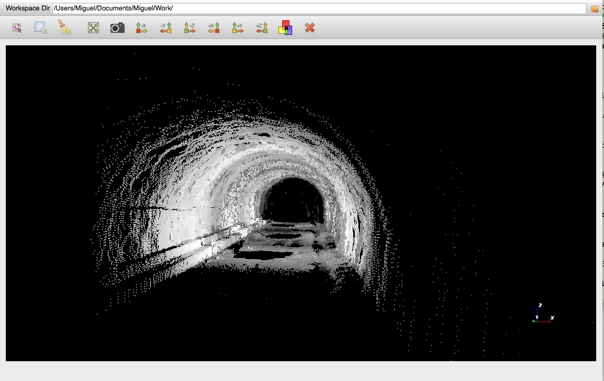

##pcloudpy

Point Cloud Viewer and Processing Toolkit in Python

This toolkit aims at providing an ease interface to display point clouds in many formats and performing diverse filtering processes. 
The project goal is to take advantage of amazing libraries such as numpy, scipy, matplotlib, vtk, pandas, pyopengl, pyside and so on to be used in the display and processing of point clouds.

-------

The main features of the pcloudpy module are the following:

- Display dense point clouds
- Selection and Cleaning of point clouds

-------

